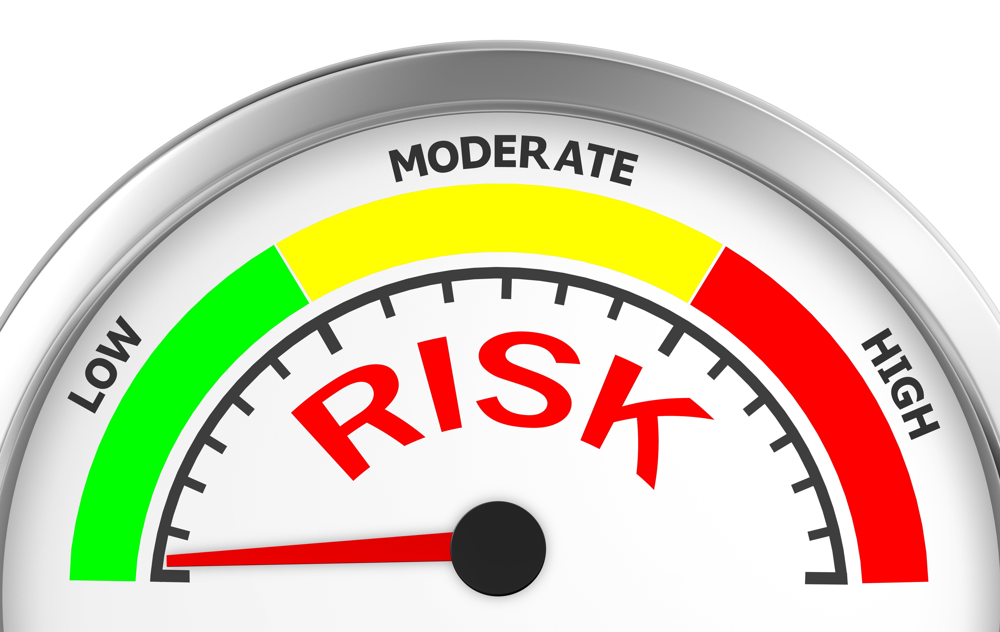
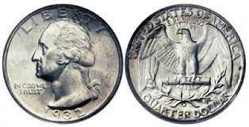
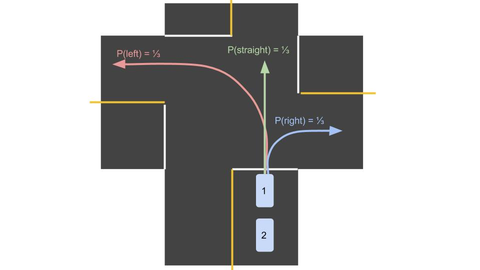

Here’s a refined version of your content to improve clarity, flow, and readability:

---

# Probability in Robotic Design Handbook

Probability plays a fundamental role in robotic movement. As humans, we solve robotic movement problems in various ways using probability methods. This project combines **basic Python programming** (functions & data structures) and **mathematics** (probability) to solve real-world problems. The source code includes multiple Jupyter notebooks, each dedicated to solving a specific probability problem.

There are **30 problems**, each contained in a separate notebook (located in the `src` folder).

## Programming Probability Distributions

This section will help you gain hands-on experience programming in Python while learning about **probability distributions**, which involve algebraic functions and their visualizations.

1. Start by implementing basic functions to calculate and visualize **continuous uniform probability distributions**.
2. Move on to programming a more complex **non-uniform discrete probability distribution**.
3. Apply these skills to explore how a robot, such as a self-driving car, represents its location probabilities in a **discrete 1-D world**.
4. Expand your understanding to a **2-D world** by using Python classes. Classes serve as programming templates, and you'll learn more about them through exercises.
5. Finally, become familiar with the **normal distribution**, a key concept in self-driving car systems.

### Uncertainty in Robotics

In the context of this handbook, nothing is ever certain:

1. **Other Traffic Behavior:** You can't predict the actions of other drivers with certainty.
2. **Your Location:** You may know your general location but not with millimeter-level precision.
3. **Speed:** Speedometers aren't perfectly accurate, and there is always some uncertainty in your speed.
4. **Steering Response:** Cars are imperfect mechanical systems, meaning the response to turning the wheel can vary slightly each time.

In this handbook, we'll address these uncertainties using **Python programming** and **probability theory**.

### Probabilistic Events in Robotics

Consider a coin flip, a perfect example of a **probabilistic event**. The outcome can be either heads or tails, with equal probability (0.5 for each). A self-driving car, however, makes hundreds of calculations about probabilistic events every second, such as:
- What’s the probability that a sensor measurement is accurate within a few centimeters?
- What’s the likelihood another vehicle will turn left, go straight, or turn right at an intersection?
- Why are the radar and lidar measurements conflicting?

These questions introduce much more complexity than a simple coin flip, making probability theory a vital tool for understanding and solving real-world robotic challenges.

### Two Cars at an Intersection

Let’s consider two cars approaching an intersection. It is equally likely for each car to turn left (L), go straight (S), or turn right (R). Using probability notation:
- P(L) = 1/3
- P(S) = 1/3
- P(R) = 1/3

The probability of specific combinations of turns can be represented as, for example, P(S, L), meaning the probability that car one goes straight and car two turns left.

### Managing Complexity

Roboticists use the term **state space** to describe all possible outcomes for a probabilistic event. For example:
- The state space for a coin flip is {H, T}.
- The state space for a car’s direction at an intersection is {L, S, R}.

As the number of events increases, so does the complexity. For example, calculating the truth table for two events with three possible outcomes each requires \(3^2 = 9\) calculations, demonstrating how exponential growth in state space size can slow down a self-driving car's performance.

---

## Introduction to Probability Distribution

### What is a Probability Distribution?

A **probability distribution** allows you to represent the likelihood of events using mathematical equations, which can be visualized on graphs or solved using algebra and calculus. These distributions simplify the analysis of complex systems, whether they involve flipping a coin or determining a self-driving car’s position.

### Types of Probability Distributions

There are two main types of probability distributions:
1. **Discrete Probability Distributions**
2. **Continuous Probability Distributions**

Each type can be visualized differently. Discrete distributions break probabilities into distinct outcomes, while continuous distributions represent probabilities over a range of values.

---

## Discrete vs. Continuous Variables

### Discrete Variables

A **discrete variable** can only take on specific values, often representing countable events. For example:
- Number of heads in a series of coin flips.
- Number of times a dice lands on 1, 2, 3, etc.

### Continuous Variables

A **continuous variable** can take on any value within a given range, often measured with instruments such as thermometers or scales. Examples include temperature, weight, or a car's speed.

---

## Continuous Probability Distributions

Unlike discrete distributions, continuous distributions cover an entire range of possible values. The probability density function (PDF) represents the likelihood of outcomes over this continuous range.

### Uniform Continuous Distribution

The **uniform continuous distribution** is the simplest form of a continuous probability distribution. It represents equal probabilities over a range and is visualized as a rectangle, where the area under the curve equals 1.

### Piece-Wise Continuous Distributions

A **piece-wise continuous distribution** divides the probability function into different parts, allowing for more complex distributions while maintaining continuity.

---

## Real-World Example: Robot Sensing

Consider a robot navigating a 1-D world. The robot is unsure of its exact location, but it assigns probabilities to being in different areas based on its sensors. Bayesian inference, through **Bayes' Theorem**, helps the robot update its beliefs about its location when new sensor data arrives.

### Bayes' Rule in Robotics

Bayesian inference is fundamental in **robot localization** and helps calculate the **posterior probability** of the robot’s location based on prior knowledge and new evidence. This is crucial in real-time decision-making, such as determining whether the robot is in a red or green zone based on imperfect sensor readings.

---

## Technology Stack
- **Python**: Programming language used throughout the project.
- **Object-Oriented Design**: Applying classes and objects to model real-world systems.
- **Jupyter Notebook**: Interactive environment for solving probability problems.
- **Data Visualization**: Graphical representations of probability distributions.
- **Machine Learning & AI**: Used for complex decision-making and predictions.
- **Localization**: Understanding a robot’s position based on probabilistic models.
- **Data Structures**: Essential for efficiently solving problems and managing data.